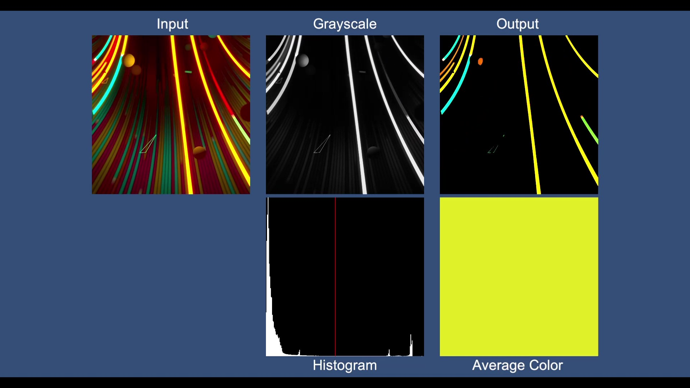

# Representative Color Estimation using Real-time Image Processing

リアルタイム画像処理を用いた代表色の推定

[Watch on Youtube](https://youtu.be/gAFJLB70v-E)

## Tested Environment
- Unity 2019.4.15f1

## Third party assets for demo scenes
以下のアセットのインポートが必要です。  
You need to import the following assets.

- [UniRx 7.1.0](https://github.com/neuecc/UniRx/releases/tag/7.1.0)  
  Licensed under the MIT License. Copyright (c) 2018 Yoshifumi Kawai.

## License
このプロジェクトは、サードパーティのアセットを除き、MIT Licenseでライセンスされています。  
This project is licensed under the MIT License excluding third party assets.
