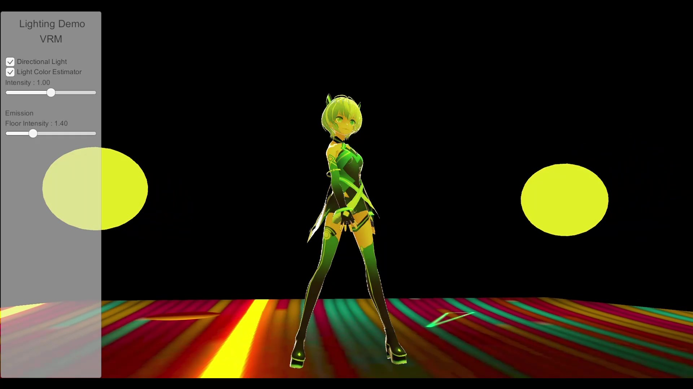
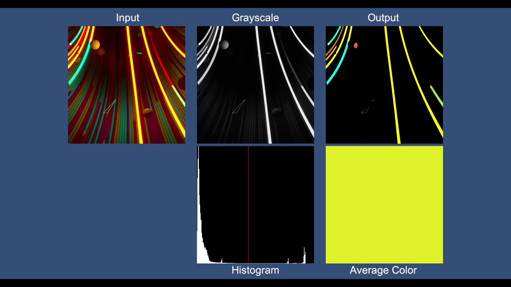

# Pseudo Real-time Environment Lighting

## リアルタイム画像処理を用いた代表色の推定 (Representative Color Estimation using Real-time Image Processing)

[Watch on Youtube](https://youtu.be/gAFJLB70v-E)

## MatCapを用いた疑似リアルタイム環境ライティング (Pseudo Real-time Environment Lighting using MatCap)
- No images

## License
このライブラリは、MIT Licenseでライセンスされています。  
This library is licensed under the MIT License.
