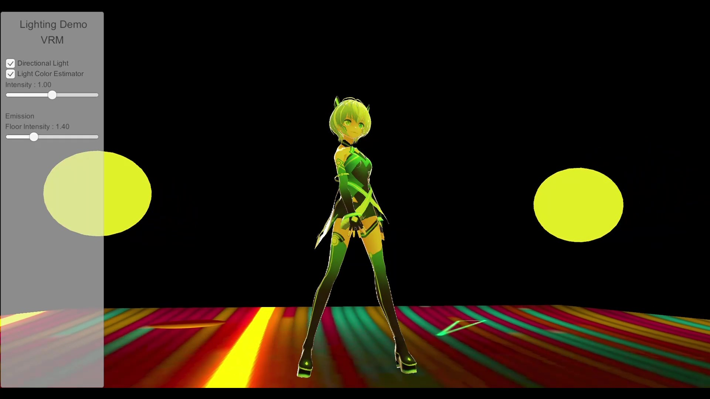

# Pseudo Real-time Environment Lighting

## リアルタイム画像処理を用いた代表色の推定 (Representative Color Estimation using Real-time Image Processing)

[Watch on Youtube](https://youtu.be/gAFJLB70v-E)

## MatCapを用いた疑似リアルタイム環境ライティング (Pseudo Real-time Environment Lighting using MatCap)
- No images

## Tested Environment
- Unity 2019.4.15f1

## Third party assets
このプロジェクトには、以下のアセットが含まれています。  
The following assets are included in this project.

- [UniRx 7.1.0](https://github.com/neuecc/UniRx/releases/tag/7.1.0)  
  Licensed under the MIT License. Copyright (c) 2018 Yoshifumi Kawai.

- [UniVRM v0.62.0](https://github.com/vrm-c/UniVRM/releases/tag/v0.62.0)  
  Licensed under the MIT License.  
  Copyright (c) 2020 VRM Consortium  
  Copyright (c) 2018 Masataka SUMI for MToon

- [Vita](https://hub.vroid.com/characters/6193066630030526355/models/3525604181073039892)  
  This character model can be downloaded from [VRoid Hub](https://hub.vroid.com/).

- [Unity-Chan Toon Shader 2.0 (UTS2) Ver.2.0.7.5](https://github.com/unity3d-jp/UnityChanToonShaderVer2_Project/releases/tag/v.2.0.7.5)  
  Licensed under the Unity-Chan License 2.0 terms. Copyright (c) Unity Technologies Japan/UCL.  
  Please refer to the following link for information regarding the Unity-Chan License.  
  http://unity-chan.com/contents/guideline_en/

- [UrbanStreetStyle Unitychan](https://unity-chan.com/download/releaseNote.php?id=Unitychan_USS&lang=en)  
  Licensed under the Unity-Chan License 2.0 terms. Copyright (c) Unity Technologies Japan/UCL.  
  Please refer to the following link for information regarding the Unity-Chan License.  
  http://unity-chan.com/contents/guideline_en/

- [UnityChanSpringBone](https://github.com/unity3d-jp/UnityChanSpringBone)  
  Licensed under the MIT License. Copyright (c) 2018 Unity Technologies ApS.

## License
このプロジェクトは、サードパーティのアセットを除き、MIT Licenseでライセンスされています。  
This project is licensed under the MIT License excluding third party assets.
